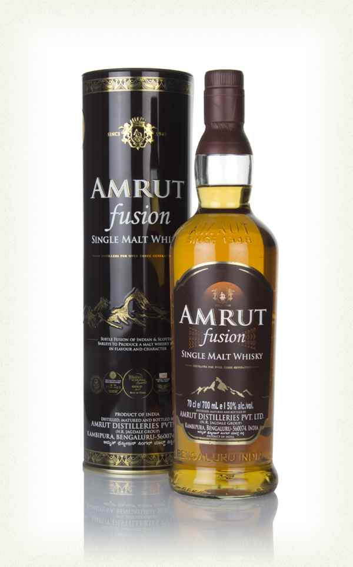

> This VSOP won a Gold Outstanding award at the 2015 International Wine and Spirits Competition. The judges' tasting notes were as follows: "Rush of dried fruit on the nose followed by lovely floral notes. Elegant entry into the mouth with fine display of flavours of biscuit, rich chocolate and warm spice. Warming flow where fruit is very evident as with sweet spice. Good balance and texture. Hints of old leather. Burst of warm spice leads into long, well fruited finish.".